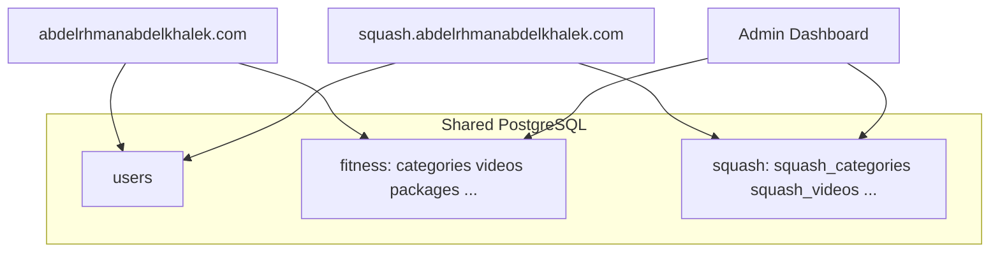

# Fitness + Squash Platform — Master Roadmap

**Version:** 1.0  
**Date:** June 2026  
**Status:** Phase 0 complete — awaiting review before Phase 1 implementation

---

## Executive Summary

This project transforms a production **Fitness training platform** (React + Express + Supabase Postgres + Cloudflare R2) into a **multi-domain training platform** supporting both **Fitness** and **Squash**, with enterprise-grade architecture, a shared design system, stable database connectivity, and a maintainable admin dashboard.

**Confirmed decisions:**

| Decision | Choice |
|----------|--------|
| Squash delivery | Same codebase; public site on `squash.abdelrhmanabdelkhalek.com` |
| Frontend language | Incremental TypeScript migration during refactor |
| Database (3–6 months) | Recommend dedicated Postgres (Neon/VPS); interim Supabase + REST fallback |
| Media | Cloudflare R2 (`pub-*.r2.dev` dev URL; `cdn.abdelrhmanabdelkhalek.com` production) |

**Timeline:** ~16–24 weeks (1–2 developers), delivered incrementally across 9 phases.

**Living tracker:** [PROJECT_CHECKLIST.md](./PROJECT_CHECKLIST.md)

---

## Current State (Phase 0 Audit)

### Frontend

| Area | State |
|------|-------|
| Stack | CRA 5, React 19, React Router 7, TanStack Query 5, Tailwind 3, JavaScript |
| Routes | `/`, `/login`, `/dashboard` only |
| Landing | Single-page scroll; sections in `App.js` |
| Dashboard | Monolithic `Dashboard.js` (3,231 lines); 8 modals extracted |
| Services | `apiClient`, `authService`, `contentService`, `uploadService` |
| Auth | JWT in localStorage; no `ProtectedRoute`; no AuthContext |
| Media | `cdn.js` rewrites Supabase URLs → R2/CDN |

### Backend

| Area | State |
|------|-------|
| Stack | Express 4, TypeScript, Prisma 6, JWT, multer, AWS SDK → R2 |
| Modules | `auth`, `content`, `uploads` |
| Data | Prisma-first + Supabase PostgREST fallback when pooler fails |
| Uploads | Proxy upload (`POST /api/uploads/proxy`) + presigned PUT |
| Auth | 15m access JWT + 7d refresh cookie; coach via `is_coach` |

### Database

**Fitness tables:** `users`, `categories`, `videos`, `packages`, `subscriptions`, `reviews`, `success_stories`, `faqs`, `user_video_access`, `user_category_access`, `refresh_tokens` (unused)

**Hosting:** Supabase Postgres; pooler often unreachable from dev → REST fallback active

**Migration toolkit:** `migration-toolkit/` — export, R2 upload, restore, verify

### Deployment

Manual cutover documented in [docs/CUTOVER_CHECKLIST.md](./docs/CUTOVER_CHECKLIST.md). No CI/CD in repo.

---

## Target Architecture

### High-level system diagram

```mermaid
flowchart TB
  subgraph clients [Clients]
    fitness_web[abdelrhmanabdelkhalek.com]
    squash_web[squash.abdelrhmanabdelkhalek.com]
    dashboard[Admin Dashboard]
  end

  subgraph frontend [React App - Single Codebase]
    router[Domain Router]
    fitness_feat[features/fitness]
    squash_feat[features/squash]
    auth_feat[features/auth]
    dash_feat[features/dashboard]
    design_sys[design-system + shared/ui]
  end

  subgraph backend [Express API]
    auth_api[/api/auth]
    fitness_api[/api - fitness]
    squash_api[/api/squash]
    upload_api[/api/uploads]
  end

  subgraph data [Data Layer]
    postgres[(PostgreSQL)]
    r2[Cloudflare R2]
    cdn[CDN pub-*.r2.dev / cdn.*]
  end

  fitness_web --> router
  squash_web --> router
  dashboard --> router
  router --> fitness_feat & squash_feat & auth_feat & dash_feat
  fitness_feat --> fitness_api
  squash_feat --> squash_api
  auth_feat --> auth_api
  dash_feat --> fitness_api & squash_api
  fitness_api & squash_api & auth_api --> postgres
  upload_api --> r2 --> cdn
  fitness_feat & squash_feat --> cdn
```

### Frontend target structure

```
src/
├── app/                    # Router, providers, error boundaries
├── features/
│   ├── fitness/            # Landing sections, fitness-specific pages
│   ├── squash/             # Squash landing + sections (subdomain-aware)
│   ├── auth/               # Login, ProtectedRoute, AuthContext
│   └── dashboard/          # Split by section: categories, videos, ...
├── shared/
│   ├── ui/                 # Button, Card, Modal, Table, FormField
│   ├── hooks/              # useAuth, useDomain, useMediaUrl
│   ├── api/                # Typed apiClient + domain services
│   ├── i18n/               # Single translation system
│   └── lib/                # cdn, currency, notifications
├── design-system/          # Tokens, themes, typography
└── types/                  # Shared TS interfaces
```

**Subdomain routing:** `window.location.hostname` or `REACT_APP_DOMAIN` → Fitness at root domain, Squash at subdomain; shared auth and dashboard with domain context.

**Shared abstraction:**

```typescript
createContentHooks({ domain: 'fitness' | 'squash', apiPrefix: '/api' | '/api/squash' })
createContentSection({ domain, entity: 'videos' })
```

### Backend target structure

```
backend/src/
├── domains/
│   ├── fitness/            # routes, service, repository
│   ├── squash/             # routes, service, repository
│   └── shared/             # auth, media, users
├── infrastructure/         # prisma, supabase-rest, r2
└── common/                 # validation, errors, logging
```

**API mounts:** `/api/auth/*` (shared), `/api/*` (fitness legacy), `/api/squash/*` (new)

### Database target



**Recommendation:** Migrate to dedicated Postgres (Neon or VPS) in Phase 1–2 to eliminate dual Prisma/REST path.

**Squash tables (new):** `squash_categories`, `squash_videos`, `squash_packages`, `squash_reviews`, `squash_success_stories`, `squash_faqs`, `squash_coaches`, `squash_programs`

**Shared:** `users`; subscriptions via `domain` column or `squash_subscriptions` (decide in Phase 5)

**Fitness tables:** Keep current names — no rename in Phase 1

**Media keys:** `categories/...` (fitness), `squash/categories/...` (squash); shared upload proxy with bucket/path allowlist

---

## Squash Module Design

### Public Squash site (`squash.abdelrhmanabdelkhalek.com`)

| Section | Fitness equivalent | Table |
|---------|-------------------|-------|
| Squash Home | Hero + About | Static + coaches highlight |
| Squash Categories | Categories | `squash_categories` |
| Squash Videos | Videos | `squash_videos` |
| Squash Packages | Packages | `squash_packages` |
| Squash Reviews | Reviews | `squash_reviews` |
| Squash Success Stories | Success Stories | `squash_success_stories` |
| Squash FAQ | FAQ | `squash_faqs` |
| Squash Coaches | AboutCoach | `squash_coaches` |
| Squash Programs | Packages variant | `squash_programs` |

### Admin dashboard

- **Domain switcher:** Fitness | Squash in sidebar
- **Reuse:** Generic `EntityTable`, `EntityFormModal`, `useEntityCrud`, entity config registry, backend `BaseRepository<T>`

---

## Technical Debt Summary

### Critical (Phase 1–2)

| Issue | Location |
|-------|----------|
| God component (3,231 lines) | `src/pages/Dashboard.js` |
| Query key mismatch on invalidation | Dashboard hooks vs `invalidateQueries` |
| Dual DB path / schema drift | Prisma + Supabase REST |
| No route guards | Missing `ProtectedRoute` |
| Legacy plaintext passwords | `backend/src/lib/auth-data.ts` |
| JWT dev defaults | `backend/src/config/env.ts` |
| Signup Prisma-only | `backend/src/modules/auth/routes.ts` |
| Unused RefreshToken model | `schema.prisma` |
| Stale README | References deleted `supabase.js` |
| Committed `backend/dist/` | Should gitignore |

### UI/UX gaps

- Hash scroll navigation (no deep links)
- No design tokens / design system
- Split i18n (Login/Dashboard vs `translations.js`)
- Limited accessibility (ARIA, skip links)
- Trainee journey incomplete (localStorage favorites)

---

## Implementation Phases

### Phase 1 — Architecture Cleanup (2–3 weeks)

**Goal:** Stabilize foundation before large refactors.

- Fix TanStack Query key alignment
- Add `AuthContext` + `ProtectedRoute`
- Database hosting decision + pooler fix OR Postgres provision
- Gitignore `backend/dist`; update README
- Remove orphaned `supabase.js`; consolidate env docs
- Align REST fallback schema (FAQ, packages columns)
- Signup REST fallback; bcrypt-only passwords (migration path for legacy)

**Exit criteria:** Login → dashboard without 401 races; CRUD invalidates cache correctly; DB strategy documented.

---

### Phase 2 — Design System (2–3 weeks)

**Goal:** Shared visual language for Fitness, Squash, and Dashboard.

- Design tokens (color, spacing, typography, RTL)
- Core UI primitives: Button, Input, Card, Modal, Table, Badge, Spinner
- Layout components: PageShell, SectionHeader, Sidebar
- Optional Storybook
- Migrate Login to design system tokens

**Exit criteria:** Token file consumed by 3+ components; Login uses shared primitives.

---

### Phase 3 — Frontend Refactor (4–6 weeks)

**Goal:** Feature-based structure; split Dashboard; start TypeScript.

- Create `src/app`, `src/features`, `src/shared` folder structure
- Extract dashboard sections (overview, categories, videos, …) from monolith
- Consolidate duplicate hooks (`useVideos` / `useDashboardVideos` → domain-aware)
- Introduce `useMutation` for CRUD
- Single i18n system
- Subdomain detection utility (`useDomain`)
- Incremental TS: services → hooks → components (priority order)
- URL-based landing sections (optional `/fitness#categories` or path routes)

**Exit criteria:** `Dashboard.js` under 500 lines (orchestrator only); build passes; no duplicate hook pairs.

---

### Phase 4 — Backend Refactor (3–4 weeks)

**Goal:** Domain-driven modules; validation; logging.

- Restructure to `domains/fitness`, `domains/squash`, `domains/shared`
- Repository layer with unified Prisma + REST fallback
- Zod validation on all write endpoints
- Structured logging (pino/winston)
- Helmet, rate limiting on auth routes
- Upload bucket/path allowlist
- Remove or implement `RefreshToken` model
- Fix `tsc` build errors; stop committing `dist/`

**Exit criteria:** Content routes split by domain; all writes validated; integration smoke tests pass.

---

### Phase 5 — Squash Module (4–5 weeks)

**Goal:** Full Squash business domain end-to-end.

- Prisma models + migration SQL for all `squash_*` tables
- `/api/squash/*` CRUD routes (mirror fitness)
- Squash landing page + all public sections
- Subdomain routing in production; local dev via hosts + env
- R2 key prefix `squash/`
- Seed data for Squash demo content

**Exit criteria:** `squash.abdelrhmanabdelkhalek.com` serves Squash content; APIs return data; media loads from R2.

---

### Phase 6 — Admin Dashboard Expansion (2–3 weeks)

**Goal:** Single admin UI for both domains.

- Domain switcher (Fitness | Squash)
- Generic entity CRUD framework
- Squash admin: categories, videos, packages, reviews, stories, FAQs, coaches, programs
- Cross-domain stats (optional)
- Trainee access for Squash (if applicable)

**Exit criteria:** Coach can CRUD all Squash entities from dashboard; domain switch preserves auth.

---

### Phase 7 — Testing (2–3 weeks)

**Goal:** Confidence for refactors and releases.

- Backend: integration tests for auth, fitness CRUD, squash CRUD, uploads
- Frontend: component tests for design system; hook tests
- E2E: login → dashboard CRUD → public page render (Playwright/Cypress)
- CI pipeline runs tests on PR

**Exit criteria:** Critical paths covered; CI green on main workflows.

---

### Phase 8 — Optimization (1–2 weeks)

**Goal:** Production performance.

- Bundle analysis; lazy-load Three.js/Splide where needed
- TanStack Query tuning (stale times, prefetch)
- Image/video loading strategy (CDN, lazy, poster frames)
- Dashboard pagination virtualisation for large lists
- Backend response compression

**Exit criteria:** Lighthouse score improvement documented; bundle size reduced.

---

### Phase 9 — Production Readiness (2 weeks)

**Goal:** Secure, deployable, monitored production.

- CDN custom domain `cdn.abdelrhmanabdelkhalek.com` connected
- CI/CD (build, test, deploy frontend + backend)
- Environment separation (dev/staging/prod)
- Security: rotate JWT secrets, bcrypt-only passwords, RLS review if on Supabase
- Monitoring: health checks, error tracking (Sentry optional)
- Runbook + updated CUTOVER_CHECKLIST
- Optional: remove Supabase REST fallback after Postgres stable

**Exit criteria:** Production deploy successful; smoke test checklist passed.

---

## Effort Summary

| Phase | Effort | Depends on |
|-------|--------|------------|
| 1 — Architecture cleanup | 2–3 weeks | — |
| 2 — Design system | 2–3 weeks | Phase 1 |
| 3 — Frontend refactor | 4–6 weeks | Phase 2 |
| 4 — Backend refactor | 3–4 weeks | Phase 1 |
| 5 — Squash module | 4–5 weeks | Phases 3–4 |
| 6 — Admin expansion | 2–3 weeks | Phase 5 |
| 7 — Testing | 2–3 weeks | Phases 3–6 |
| 8 — Optimization | 1–2 weeks | Phase 7 |
| 9 — Production readiness | 2 weeks | All |

**Total:** ~16–24 weeks

Phases 3 and 4 can partially overlap after Phase 1 completes.

---

## Risks and Mitigations

| Risk | Impact | Mitigation |
|------|--------|------------|
| Supabase pooler / dual DB path | 500 errors, schema drift | Dedicated Postgres in Phase 1; keep REST fallback until stable |
| Dashboard refactor breaks CRUD | Admin unusable | Split by section; feature flags; test each section |
| Squash duplication | 2× maintenance | Generic entity framework before Squash UI |
| Subdomain local dev | Hard to test Squash | `hosts` file + `REACT_APP_DOMAIN` override |
| Schema drift | Prisma vs live DB mismatch | `prisma db pull` after Postgres cutover |
| Scope creep | Delayed delivery | PROJECT_CHECKLIST.md gate; no phase skip |
| TS migration friction | Build breaks | Incremental; JS files coexist until migrated |
| Large video uploads | Timeouts | Proxy upload; chunked upload (future) |

---

## Dependencies

| Dependency | Required for |
|------------|--------------|
| Cloudflare R2 public URL or CDN DNS | Media in all environments |
| Postgres connectivity decision | Phase 1 exit; Phases 4–5 |
| Design tokens approved | Phase 2 exit; Phase 3 UI work |
| Generic CRUD framework | Phase 6; avoids Squash duplication |
| Squash content/branding assets | Phase 5 public site |

---

## Implementation Rules (All Phases)

1. Explain plan and list files before coding
2. Implement smallest vertical slice
3. Verify: `npm run build`, backend `tsc`, lint, API smoke tests
4. Update [PROJECT_CHECKLIST.md](./PROJECT_CHECKLIST.md)
5. Commit-ready summary (commit only when requested)

**Status legend:** `[ ]` Not Started · `[~]` In Progress · `[x]` Completed

Never mark `[x]` unless implementation is verified.

---

## Document Index

| Document | Purpose |
|----------|---------|
| [ROADMAP.md](./ROADMAP.md) | This file — strategy and phases |
| [PROJECT_CHECKLIST.md](./PROJECT_CHECKLIST.md) | Granular task tracker |
| [docs/CUTOVER_CHECKLIST.md](./docs/CUTOVER_CHECKLIST.md) | Production migration |
| [docs/cloudflare-cdn.md](./docs/cloudflare-cdn.md) | R2/CDN configuration |
| [migration-toolkit/README.md](./migration-toolkit/README.md) | Data export/import |

---

## Next Step

**Review this roadmap and [PROJECT_CHECKLIST.md](./PROJECT_CHECKLIST.md).**  
Once approved, begin **Phase 1 — Architecture Cleanup**. Do not skip phases.
