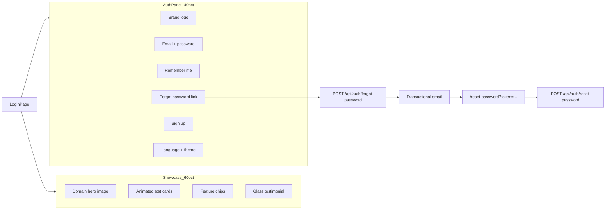

# Premium Login Page Redesign — Design Plan

**Status:** In progress  
**Scope:** Replace the centered legacy login (`src/pages/Login.js`) with a split-screen premium SaaS experience while preserving all auth behavior and adding forgot/reset password + remember me.

---

## Design goals

1. **Premium SaaS aesthetic** — Dark elite palette, glass morphism, domain-tinted gradients, Framer Motion polish.
2. **Split layout** — 60% showcase (hero, stats, features, testimonial) + 40% auth panel (form, toggles).
3. **Zero hardcoded UI text** — All copy in `login.en.js` / `login.ar.js` via `getLoginTranslation(lang, key)` and `useLanguage()`.
4. **Behavior preservation** — Coach/trainee redirects, signup domain query, prefetch, session bootstrap unchanged.
5. **Accessibility first** — Semantic landmarks, focus rings, `aria-live` alerts, reduced-motion fallbacks.
6. **Page-scoped theme** — Login dark palette does not override global dashboard theme.

---

## Current state

| Area | Location | Notes |
|------|----------|-------|
| Login UI | `src/pages/Login.js` (~810 lines) | Centered glass card, inline EN/AR strings, FontAwesome icons |
| Auth context | `src/contexts/AuthContext.js` | `login()`, coach/trainee detection, session bootstrap |
| Routes | `src/shared/lib/authRoutes.js` | `?domain=fitness\|squash`, `traineeHomePath()`, coach → `getDefaultDashboardPath()` |
| API | `src/shared/api/authService.ts` | JWT in memory, refresh cookie on login |
| Providers | `src/app/providers.jsx` | `LanguageProvider`, `ThemeProvider`, `AuthProvider` already wrap login |
| Design precedents | `DomainPortalPage.jsx`, `domain-portal.css` | Dark gradients, motion |
| Hero imagery | `features/fitness/assets/unsplashImages.js`, `features/squash/assets/unsplashImages.js` | Domain hero images |
| Motion pattern | `features/squash/motion/SquashReveal.jsx` | `useReducedMotion()` guard |
| Password reset API | — | **Not implemented** — only login/signup/refresh/logout/me today |

---

## Target architecture



---

## Layout

### Desktop (`lg+`)

- CSS grid: **60% showcase / 40% auth panel**
- Full viewport height (`min-height: 100dvh`)
- Showcase: hero image with gradient overlay, stat row, feature chips, glass testimonial card
- Auth panel: vertically centered form stack with logo, inputs, remember me, forgot link, CTA, signup link, language + theme toggles

### Tablet (`md`)

- Same 60/40 ratio with tighter padding and slightly smaller stat cards

### Mobile (`< md`)

- `flex-direction: column`
- **Showcase first**, auth panel second (per spec)
- No horizontal scroll; stat cards wrap or scroll horizontally within container

### Root attributes

- `data-login-page` on root wrapper
- Optional `data-login-domain="fitness|squash"` for domain-tinted gradients (from `?domain=` query)

---

## Visual tokens (`login-page.css`)

Login-scoped CSS variables — do **not** override global dashboard theme:

| Token | Value | Usage |
|-------|--------|-------|
| `--login-bg` | `#050816` | Page background |
| `--login-surface` | `#0B1220` | Card / panel surfaces |
| `--login-accent` | `#D7FF3F` | CTAs, focus rings, glow |
| `--login-text` | `#F8FAFC` | Primary text |
| `--login-text-muted` | `rgba(248, 250, 252, 0.65)` | Subtitles, placeholders |
| `--login-border` | `rgba(255, 255, 255, 0.08)` | Glass borders |
| `--login-glow` | `0 0 40px rgba(215, 255, 63, 0.12)` | Accent glow on hover |

### Glass morphism

```css
backdrop-filter: blur(20px);
border: 1px solid rgba(255, 255, 255, 0.08);
background: rgba(11, 18, 32, 0.72);
```

### Domain tints

- **Fitness:** green accent gradient overlay on hero
- **Squash:** light-green / court-green gradient overlay
- Default (no domain): neutral dark gradient

### Focus

- `:focus-visible` ring using `--login-accent` (2px outline + offset)

---

## Component map

```
src/features/auth/login/
  LoginPage.jsx              # orchestrator (replaces Login.js body)
  LoginShowcase.jsx          # left: image, stats, features, testimonial
  LoginAuthPanel.jsx         # right: form, remember, forgot, toggles
  LoginSignupPanel.jsx       # slide-over / modal signup (redesigned)
  ForgotPasswordPanel.jsx    # email request step
  ResetPasswordPage.jsx      # /reset-password route
  useLoginAuth.js            # extracted handlers + redirects
  loginStats.js              # stat config (+5000, +800, etc.)
  login.motion.js            # Framer Motion variants + reduced-motion guard
  login-page.css
  index.js                   # re-export LoginPage

src/pages/Login.js             # thin re-export (preserve lazy chunk path)

src/shared/i18n/
  login.en.js
  login.ar.js
  getLoginTranslation() in index.js
```

### Router updates (`src/app/router.jsx`)

- Keep lazy import `../pages/Login` (no chunk rename)
- Add route `/reset-password` → `ResetPasswordPage`

---

## i18n

All UI strings live in `login.en.js` / `login.ar.js`. Categories:

| Category | Key prefix | Examples |
|----------|------------|----------|
| Showcase | `showcase.*` | brand headline, tagline, stats, features, testimonial |
| Auth (legacy + new) | `login-*`, `auth.*`, `remember-me`, `forgot-password` | welcome, labels, placeholders |
| Forgot / reset | `forgot.*`, `reset.*` | request sent, token invalid/expired |
| Validation | `validation.*`, `error-text`, `signup.error` | required, invalid email, min length |
| Signup | `signup-*`, `fullname-*`, `phone-*` | create account flow |
| Accessibility | `a11y.*` | theme, language, password visibility, stat aria-labels |

Wire via `useLanguage()` from `LanguageContext` — remove duplicate `currentLanguage` / `toggleLanguage` / `updateDirection` from login components.

```js
import { getLoginTranslation } from '../shared/i18n';
const { currentLanguage } = useLanguage();
const t = (key) => getLoginTranslation(currentLanguage, key);
```

---

## Auth behavior (must preserve)

| Flow | Behavior |
|------|----------|
| Coach login | `login()` → `prefetchDashboardData('fitness')` → `getDefaultDashboardPath()` |
| Trainee login | `traineeHomePath(signupDomain)` + welcome state messages |
| Already authenticated | `useEffect` redirect (coach vs trainee) |
| Signup | `authService.signUp` with `registered_from: signupDomain` |
| Domain query | `parseSignupDomain(searchParams.get('domain'))` |

---

## New features

### Remember me

- **UI:** checkbox in auth panel
- **Email:** `localStorage.loginRememberEmail` when checked; prefill on mount
- **Session:** optional `rememberMe: boolean` on login → refresh cookie `maxAge` 30 days (default 7)

### Forgot password + reset

**Database:** `PasswordResetToken` model in Prisma schema.

**Backend:**

- `POST /auth/forgot-password` — `{ email }` — rate-limited; always `200 { message }` (no enumeration)
- `POST /auth/reset-password` — `{ token, password }` — validate hash, update password, invalidate token

**Email:** Resend (or SMTP via nodemailer if `SMTP_*` set). Env: `RESEND_API_KEY`, `EMAIL_FROM`, `APP_PUBLIC_URL`.

**Frontend:**

- `ForgotPasswordPanel.jsx` → `authService.requestPasswordReset(email)`
- `ResetPasswordPage.jsx` → `authService.resetPassword(token, password)`

---

## Animations (Framer Motion)

In `login.motion.js`:

| Element | Animation |
|---------|-----------|
| Page enter | Staggered fade + slide-up, `ease: [0.22, 1, 0.36, 1]` |
| Stat cards | Subtle float loop + hover scale |
| Glass cards | `whileHover={{ y: -4 }}` + accent border glow |
| Auth panel | Slide from right (LTR) / left (RTL) |
| Reduced motion | Static fallbacks via `useReducedMotion()` (same as `SquashReveal`) |

---

## Accessibility

| Requirement | Implementation |
|-------------|----------------|
| Landmarks | `<main>`, `<section aria-label={t('a11y.showcase-label')}>`, `<form aria-labelledby="login-heading">` |
| Keyboard | All controls focusable; `:focus-visible` ring with `--login-accent` |
| Password toggle | `aria-pressed` + `a11y.show-password` / `a11y.hide-password` |
| Alerts | `role="alert"` + `aria-live="polite"` on error/success regions |
| Stat numbers | `aria-label` with full translated value (`a11y.stat.*`), not animated digits alone |
| Remember me | `a11y.remember-me` on checkbox label association |

---

## Verification checklist

| Area | Test |
|------|------|
| Coach login | Redirects to `/dashboard/...` |
| Trainee login | Redirects to `/fitness` or `/squash` per `?domain=` |
| Token storage | Access token set; refresh cookie present |
| AuthContext | Session restore on refresh |
| Arabic | Full RTL, all labels translated |
| English | LTR, all labels translated |
| Mobile | Showcase above auth; no horizontal scroll |
| Forgot password | Email sent (or logged in dev); reset link works |
| Remember me | Email prefilled; longer cookie when checked |
| Build | `npm run build` succeeds |

---

## Risk notes

- **Email on Vercel:** requires `RESEND_API_KEY` (or SMTP); without it, forgot-password returns success but logs warning in dev — document in REPORT.
- **Login dark theme** is page-scoped; global `ThemeProvider` toggle still works but login CSS defaults to elite dark palette.
- **Chunk size:** lazy route preserved; new CSS + motion adds ~15–25 KB gzip — acceptable for login chunk.

---

## Implementation order

1. Docs scaffold + i18n files ✅
2. `login-page.css` + motion variants
3. Split UI components (showcase + auth panel) with placeholder handlers
4. Extract `useLoginAuth` and wire existing flows
5. Backend password reset + email + migration
6. Frontend forgot/reset UI + `authService` methods + router
7. Remember me (frontend + backend cookie duration)
8. QA + `npm run build` + fill `LOGIN_REDESIGN_REPORT.md`
