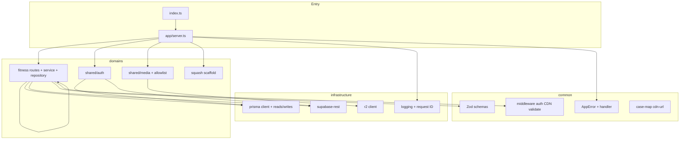

# Phase 4 — Backend Refactor Completion Report

**Date:** 2026-06-04  
**Status:** Complete

---

## Architecture (post–Phase 4)

---

## Migrated modules

| Before | After |
|--------|-------|
| `modules/auth/routes.ts` | `domains/shared/auth/routes.ts` |
| `modules/content/routes.ts` | `domains/fitness/routes.ts` + `fitness.service.ts` |
| `modules/uploads/routes.ts` | `domains/shared/media/routes.ts` |
| `lib/prisma-data.ts` | `infrastructure/prisma/fitness-reads.ts` |
| `lib/prisma-writes.ts` | `infrastructure/prisma/fitness-writes.ts` |
| `lib/prisma.ts` | `infrastructure/prisma/client.ts` |
| `lib/supabase-data.ts` | `infrastructure/supabase-rest/client.ts` |
| `lib/r2.ts` | `infrastructure/r2/client.ts` |
| `lib/auth-data.ts` | `domains/shared/auth/user.repository.ts` |
| `lib/jwt.ts` | `domains/shared/auth/jwt.ts` |
| `lib/cdn-url.ts`, `case-map.ts` | `common/utils/` |
| `middleware/error.ts` | `common/errors/handler.ts` |
| `middleware/auth.ts` | `common/middleware/auth.ts` |
| `middleware/cdn-urls.ts` | `common/middleware/cdn-urls.ts` |
| — | `domains/squash/` (scaffold) |
| — | `app/server.ts` |

`lib/*` and old `middleware/*` remain as **deprecated re-exports** for compatibility.

---

## Remaining technical debt

| Item | Priority | Notes |
|------|----------|-------|
| Dual Prisma/REST data path | Medium | Unchanged behavior; consolidate further when Postgres migrates |
| `RefreshToken` Prisma model unused | Low | Cookie JWT refresh works; DB rotation deferred |
| `lib/` re-export shims | Low | Remove after all imports updated |
| Structured logging | Low | JSON to stdout; consider pino in Phase 7/8 |
| Trainee dashboard orphan files | Low | Frontend hygiene (Phase 3 note) |
| Squash domain | Phase 5 | Tables + `/api/squash/*` CRUD |

---

## Phase 5 readiness score: **8 / 10**

**Ready:**
- Domain folders and mount pattern for `/api/squash`
- Shared auth and media with allowlist extensible for `squash/` prefix
- Validation and error patterns reusable for squash entities
- API smoke and `tsc` green

**Gaps before Phase 5:**
- Prisma models + migration SQL for `squash_*` tables
- Squash repository/service/routes (mirror fitness)
- R2 allowlist entries for `squash/*` buckets
- Frontend squash sections wired to real APIs

---

## Verification summary

- **Build:** `npm run backend:build` — PASS  
- **Smoke:** Phase 3 matrix + empty-body 400 + upload allowlist — PASS  
- **Frontend:** Unchanged (per Phase 4 rules)

See [PHASE4_PROGRESS.md](./PHASE4_PROGRESS.md) for per-milestone detail.
