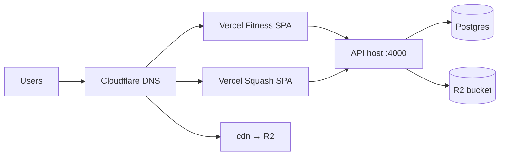

# Phase 9 Deployment Plan (Comprehensive)

**Status:** Implementation-ready — **READY_FOR_IMPLEMENTATION = YES** (2026-06-04)  
**GO_LIVE:** **NO** until Vercel + API host deployed and smoke signed off.  
**Constraint:** No Railway.toml / VPS deploy code changes in repo — documentation and env templates only for backend.

**Do not paste secrets into docs or commits.**

---

## 1. Objectives

| Goal | Primary platform | Doc |
|------|------------------|-----|
| Fitness + Squash SPAs | **Vercel** (2 projects) | `docs/VERCEL_DEPLOYMENT.md` |
| Node API + Postgres | Railway / Render / VPS (operator choice) | §4, `backend/.env.production.example` |
| Media CDN | Cloudflare R2 + `cdn.abdelrhmanabdelkhalek.com` | `docs/cloudflare-cdn.md` |
| DNS | Cloudflare (operator account) | §6 |
| Ops | Health, backups, rollback | `docs/MONITORING_REPORT.md`, `docs/CUTOVER_CHECKLIST.md` |

---

## 2. Target architecture



| Component | Hostname | Build / runtime |
|-----------|----------|-----------------|
| Fitness SPA | `abdelrhmanabdelkhalek.com`, `www` | Vercel, `REACT_APP_DOMAIN=fitness` |
| Squash SPA | `squash.abdelrhmanabdelkhalek.com` | Vercel (2nd project), `REACT_APP_DOMAIN=squash` |
| API | `api.abdelrhmanabdelkhalek.com` (recommended) | Node `backend/dist/index.js` |
| CDN | `cdn.abdelrhmanabdelkhalek.com` | R2 custom domain |
| Database | Managed Postgres | Prisma, migrations |

**Alternative frontend:** Cloudflare Pages (§5b) — same `build/` output and env vars; use `_redirects` or Pages SPA mode instead of `vercel.json`.

---

## 3. Pre-deploy checklist

- [x] `npm run build` + `npm run backend:build` PASS (2026-06-04)
- [x] `npm run test:e2e:gate` PASS (12/12)
- [x] `vercel.json` + Vercel docs committed
- [ ] Rotate keys ever in git; fresh prod JWT (32+ chars)
- [ ] Final backup (`npm run backup-all` or Supabase dashboard)
- [ ] `CORS_ORIGIN` lists all prod frontends
- [ ] `USE_CDN` / `REACT_APP_USE_CDN` aligned after smoke

---

## 4. Backend deploy (documentation only)

**Do not modify Railway/VPS deploy files in this repo.**

### 4.1 Provision

1. Postgres instance (Neon, Railway Postgres, Supabase dedicated, VPS).
2. Apply schema: restore from `backup/` **or** `npx prisma migrate deploy` on empty DB (see `docs/PRODUCTION_DATABASE_REPORT.md`).
3. Copy `backend/.env.production.example` → host secret store.

### 4.2 Required env (names only)

| Variable | Notes |
|----------|-------|
| `NODE_ENV` | `production` |
| `DATABASE_URL` | Direct or pooler URL |
| `JWT_SECRET`, `JWT_REFRESH_SECRET` | Required when `NODE_ENV=production` |
| `CORS_ORIGIN` | `https://abdelrhmanabdelkhalek.com,https://www...,https://squash...` |
| `R2_*`, `USE_CDN`, `CDN_BASE_URL` | Media |
| `SUPABASE_*` | Optional REST fallback |

### 4.3 Start command

```powershell
npm run backend:build
node backend/dist/index.js
```

Host-specific: set `PORT` / `API_PORT` per platform (Railway injects `PORT` — map in platform UI if needed; **no repo change**).

### 4.4 Verify

- `GET https://api.<domain>/api/health` → `{"ok":true}`
- Coach login
- Small upload via `/api/uploads/proxy`
- `backend/scripts/smoke-squash-access.mjs` against prod URL (optional)

### 4.5 Platform notes (operator)

| Platform | Pros | Steps |
|----------|------|-------|
| **Railway** | Managed Node + Postgres addon | New service → GitHub root → start `node backend/dist/index.js` → env from template |
| **Render** | Free tier Web Service | Build: `npm run backend:build`; Start: `node backend/dist/index.js` |
| **VPS** | Full control | PM2/systemd, nginx reverse proxy TLS, firewall |

---

## 5. Frontend deploy

### 5a. Vercel (primary)

See **`docs/VERCEL_DEPLOYMENT.md`** and **`docs/VERCEL_CHECKLIST.md`**.

Summary:

1. Two Vercel projects (fitness + squash).
2. Env vars from `.env.production.example` / `.env.production.squash.example`.
3. Custom domains on each project.
4. `vercel.json` rewrites for React Router.

```powershell
# Local verification only
npm run build
# vercel --prod   # after vercel login
```

### 5b. Cloudflare Pages (alternative)

| Step | Action |
|------|--------|
| 1 | Pages → Create project → connect Git |
| 2 | Build: `npm run build`, Output: `build` |
| 3 | Env: same `REACT_APP_*` as Vercel |
| 4 | SPA: add `public/_redirects` with `/* /index.html 200` **or** Pages "Single Page Application" setting |
| 5 | Custom domains: apex + `squash` subdomain (two projects or branch rules) |

Squash still needs **`REACT_APP_DOMAIN=squash`** at build time — use separate Pages project.

---

## 6. DNS records (Cloudflare — manual)

**Requires user Cloudflare account.** Exact targets shown in Vercel/Railway dashboards after linking.

| Record | Type | Name | Target | Proxy |
|--------|------|------|--------|-------|
| Apex | A / CNAME | `@` | Vercel fitness | DNS only or proxied per preference |
| WWW | CNAME | `www` | Vercel | Optional redirect |
| Squash | CNAME | `squash` | Vercel squash project | |
| API | CNAME | `api` | Railway/Render/VPS host | Proxied optional |
| CDN | CNAME | `cdn` | R2 custom domain (dashboard creates) | Usually proxied |

**SSL:** Vercel issues certs automatically. Cloudflare "Full (strict)" when proxying to Vercel/API.

**Verified 2026-06-04:** `cdn.abdelrhmanabdelkhalek.com` resolves; sample object returns **HTTP 200** (same ETag as `pub-*.r2.dev`).

---

## 7. CDN & CORS

Follow **`docs/cloudflare-cdn.md`**.

| Phase | `USE_CDN` / `REACT_APP_USE_CDN` | URL base |
|-------|----------------------------------|----------|
| Staging | `false` or test `pub-*.r2.dev` | Dev public URL |
| Production | `true` | `https://cdn.abdelrhmanabdelkhalek.com` |

**Cache headers:** R2 public objects served via Cloudflare; set cache rules in Cloudflare dashboard for `cdn.*` (static assets long TTL, API not on CDN).

**CORS:** Browser uploads via API proxy avoid R2 CORS; presigned PUT requires bucket CORS for prod origins.

---

## 8. CI/CD

Existing: `.github/workflows/ci.yml` (build + test).

**Recommended additions (operator, not committed):**

| Workflow | Trigger | Steps |
|----------|---------|-------|
| `deploy-vercel` | tag / manual | `vercel deploy --prod` (fitness + squash) |
| `deploy-api` | tag / manual | `backend:build`, platform CLI deploy, curl health |

---

## 9. Post-deploy smoke (48h)

- [ ] Fitness + squash public pages
- [ ] Coach login + one CRUD per domain
- [ ] Media via CDN hostname
- [ ] Mobile + RTL spot check
- [ ] `docs/PHASE9_GO_LIVE_CHECKLIST.md` signed

---

## 10. Rollback

1. Revert DNS to previous stack.
2. Restore Postgres from `backup/` / `backups/`.
3. Redeploy last known-good Vercel deployment (instant rollback in dashboard).

See `docs/CUTOVER_CHECKLIST.md`, `docs/BACKUP_AND_RESTORE_REPORT.md`.

---

## 11. Document index

| Doc | Purpose |
|-----|---------|
| `docs/PHASE9_PROGRESS.md` | Milestone tracker |
| `docs/PHASE9_GO_LIVE_CHECKLIST.md` | All milestone checklists |
| `docs/GO_LIVE_REPORT.md` | Executive gate |
| `docs/VERCEL_DEPLOYMENT.md` | Vercel primary |
| `docs/PRODUCTION_DATABASE_REPORT.md` | DB audit |
| `docs/SECURITY_AUDIT_REPORT.md` | Security |
| `docs/MONITORING_REPORT.md` | Ops |
| `PROJECT_CHECKLIST.md` | Master tracker |
